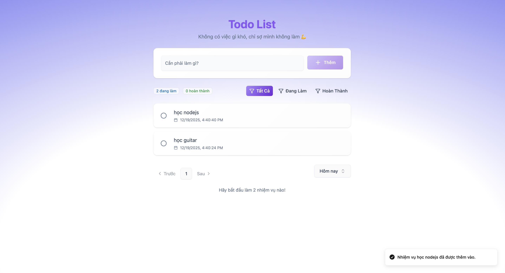
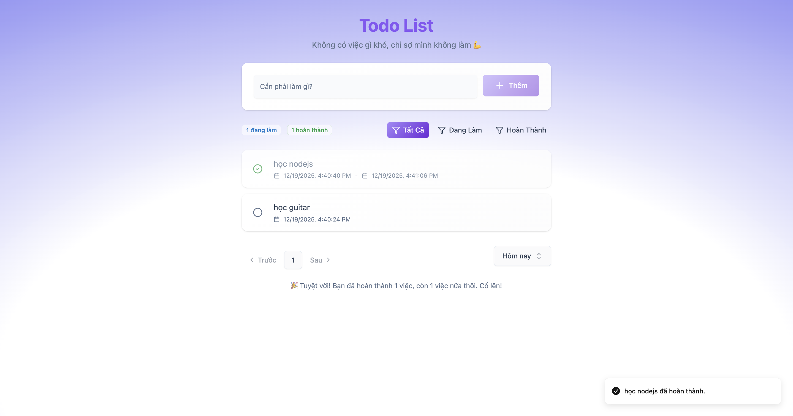
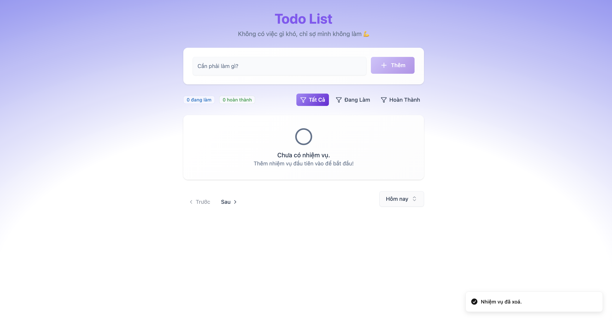
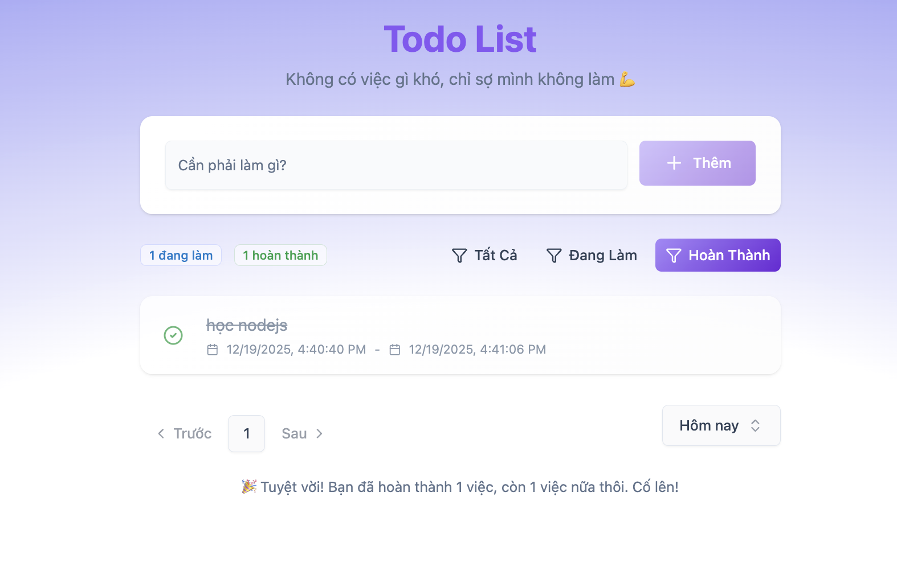

Đây là một ứng dụng Todo App hiện đại bằng React.js, Express, Node.js và MongoDB. Ứng dụng cho phép người dùng thêm mới, sửa và xóa công việc. Lọc nhiệm vụ theo trạng thái đã hoàn thành, đang làm, hoặc theo tuần hoặc tháng.

---

## Tech

React.js – Thư viện JavaScript để xây dựng giao diện web (UI) theo dạng component.

Express –  Framework cho Node.js, dùng để xây dựng API và backend server.

Node.js – Môi trường chạy JavaScript phía server, hỗ trợ xử lý bất đồng bộ và xây dựng backend.

MongoDB –  Cơ sở dữ liệu NoSQL dạng document, lưu trữ dữ liệu linh hoạt và dễ mở rộng.

GitHub – Triển khai 

---

### Clone & Run

```bash
git clone https://github.com/win11nt/Todo-App-with-MERN-Stack-2025.git
cd backend 
npm install
node src/server.js
````
Open terminal ở tab mới
```bash
cd frontend
npm install
npm run dev
````
---

## 🖼️ Demo

<div align="center">
  <h2>Giao diện</h2>
  
</div>

<div align="center">
  <h2>Thêm</h2>
  
</div>

<div align="center">
  <h2>Hoàn thành</h2>
  
</div>

<div align="center">
  <h2>Xóa</h2>
  
</div>

<div align="center">
  <h2>Lọc</h2>
  
</div>

---